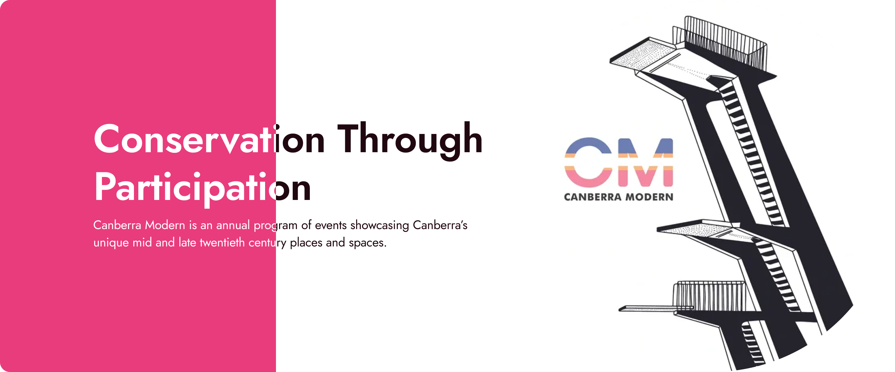

# Canberra Modern | Responsive Website

**Live Website:** [Canberra Modern Website](https://otto-s-websites.github.io/Canberra-Modern-Website)

**

## 1. The journey from prototype to a functional website
The project used an iterative process starting with the client brief, and moving to the ideation phase. Using Figma's design tools and prototyping capabilities, a first structure of the website vision was created, and then moved to a prototype version for a more refined exploration of the proof of concept. The next step was to translate this to a tangible solution using pure code or modern tools with coding capabilities. Instead of relying on slow processes and manual implementation, I prioritised a hybrid approach where I created boilerplates for the structure, navigation and main layouts for the website using a combination of Google Gemini, and manual HTML, CSS and JS. This ensured the implementation could adapt to different screen sizes while maintaining the structural integrity of the original design with its different aspects and achieve the closest version possible of the original design.

* **Design & Brand Identity:** A major priority was maintaining strict adherence to the brand guidelines established in the high-fidelity prototypes and use modularity. Using CSS variables globally to implement brand colours, such as the signature magenta and charcoal, alongside the primary 'Jost' font. This approach ensured consistency across all pages and ensured the implementation of the DRY concept from programming.

* **Minimal diversion:** While the website heavily mirrors the prototypes, minor changes and design decisions were made for a more modern look. For example, some grids were adapted into more coherent layouts, border radius was increased to provide a more welcoming feeling, and finally, small tweaks to icons, and buttons, for consistency across the website.

## 2. Challenges & Problem Solving Strategy
* **The Curved Carousel:** Implementing the custom carousel UI was a technical hurdle. Translating a curved, seamless visual from a static design into functional CSS/JS required research and multiple adjustments through trial and error to achieve the desired design and implement the infinite scrolling mechanics.

* **Responsive layouts:** Scaling complex, multi-column desktop layouts down to a mobile view presented persistent stacking challenges. Elements like the hero section images, and absolute-positioned elements such as the "At Risk" badges, required specific media query breakpoints to flow correctly.

* **Matching the design:** Matching the prototype design required constant rewrites and iterations of the code. This involved fighting native browser component styling, overriding default spacing in flex containers and adapting all of this to the mobile version, as it ended up affecting responsive layouts.

* **My Strategy (Iteration & Adaptation):** My core problem-solving strategy relied on iteration and adaptation. Rather than rewriting entire blocks when a layout broke, I isolated bugs using browser Developer Tools, tested targeted CSS tweaks in real-time, and adapted the layout logic dynamically before committing the changes to the codebase, which directly connects to my decision to use a hybrid approach to build the website.

## 3. Resources Used
* **W3Schools & MDN Web Docs:** Used for quick syntax referencing, validating CSS properties and understanding constraints.

* **Google Gemini:** Utilised as an efficiency tool to create boilerplates, fast iterations, quick debugging and logic understanding and broad exploration of layout implementation.

* **GitHub Copilot:** This was crucial for efficiency during the final stages of development. I leveraged the project context capabilities to execute bulk text replacements and image source swapping seamlessly across multiple files, and resolve any final issues or bugs.

* **Figma Education Tutorials:** Provided foundational guidance and aiding in the creation of the initial low-fi and high-fi prototypes prior to the coding phase.

## 4. Reflection & Future Skills
I successfully built a multi-page, fully responsive website, effectively translating a visual design into a functional digital product. The project was taken from a client brief to a full digital deliverable that can be accessed online.

* **Areas for Improvement:** A critical area for future implementations is creating an isolated CSS file for global styles to achieve modularity and readable code, while constraining individual and page specific styles to a dedicated css file. e.g. about.css.

## 5. GenAI Usage Commentary
* **Strategic Application:** Generative AI was utilised strictly as an assistive tool to accelerate workflow, rather than a monolithic site generator. 
* **Prompting & Implementation:** The development process required a high volume of micro-prompts aimed at specific, isolated issues (e.g., "Create initial html boilerplate using best practices, good semantics and taking accessibility into consideration throughout the project."). Because the AI was used iteratively, logging every individual prompt is impractical.